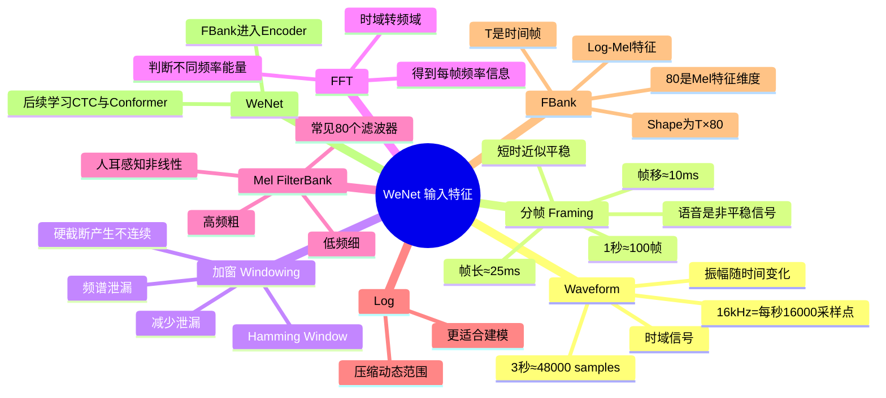

# WeNet 第一周 · Day 1：语音特征与 FBank

## 1. 本节学习目标

理解一段原始 `.wav` 音频在进入 WeNet Encoder 之前，如何从时域波形逐步变成神经网络可以使用的 Log-Mel FBank 特征。

核心链路：

```text
Waveform
  ↓
分帧（Framing）
  ↓
加窗（Windowing）
  ↓
FFT / STFT
  ↓
功率谱（Power Spectrum）
  ↓
Mel FilterBank
  ↓
Log
  ↓
Log-Mel FBank [T, 80]
  ↓
WeNet Encoder
```

---

## 2. Waveform 与采样率

数字音频本质上是一串随时间变化的振幅采样值。

例如采样率为 16 kHz：

- 每秒采样 16,000 次。
- 3 秒音频包含约 `3 × 16000 = 48000` 个采样点。
- 原始单通道 waveform 可以看作长度约为 `[48000]` 的一维序列。

### 关键概念

- **Waveform**：描述振幅随时间的变化，属于时域表示。
- **Sample Rate**：每秒采集多少个样本，例如 16 kHz = 16,000 samples/s。
- 原始 waveform 不会直接告诉我们“200 Hz、1000 Hz 分别有多强”。

---

## 3. 为什么需要分帧？

语音是**非平稳信号**：随着人不断发出不同音素，频谱结构会持续变化。

因此不能简单地对几秒钟的整段语音只做一次 FFT，否则只能知道整段音频总体有哪些频率，而丢失“这些频率什么时候出现”的信息。

在很短的时间范围内，可以近似认为语音是平稳的，因此先将语音划分成短帧。

常见参数：

```text
帧长 Frame Length：25 ms
帧移 Frame Shift：10 ms
```

16 kHz 下：

```text
25 ms × 16000 = 400 samples
10 ms × 16000 = 160 samples
```

因此相邻帧会重叠：

```text
第 1 帧：0 ~ 399
第 2 帧：160 ~ 559
第 3 帧：320 ~ 719
...
```

### 帧数计算

不考虑 padding 时：

```text
N = floor((音频长度 - 帧长) / 帧移) + 1
```

3 秒音频：

```text
N = floor((3000 - 25) / 10) + 1
  = 298
```

快速估算时可以记：

```text
1 秒 ≈ 100 帧
3 秒 ≈ 300 帧
4 秒 ≈ 400 帧
```

> **核心理解：帧长决定每次观察多长的声音；帧移决定多久产生一个新的特征帧。**

---

## 4. 为什么需要加窗？

直接从连续 waveform 中硬切出一帧，会在帧的两端产生人为的截断和不连续。

FFT 会把这种突然变化也解释为额外的频率成分，从而造成 **频谱泄漏（Spectral Leakage）**。

### 频谱泄漏

理想情况：某个频率的能量集中在其真实位置。

```text
能量
 ↑
 │        █
 │        █
 │        █
 └────────█────────→ Frequency
        1000 Hz
```

发生频谱泄漏后，能量会扩散到附近频率：

```text
能量
 ↑
 │       ▃█▃
 │     ▁█████▁
 └───▁█████████▁───→ Frequency
        1000 Hz
```

这会让后续 Mel 频带的能量分布受到人为干扰。

### 窗函数

常见做法是给每帧乘 Hamming Window 等窗函数，使两端权重逐渐降低，减轻硬截断产生的频谱泄漏。

需要知道它存在 trade-off：减少旁瓣泄漏的同时，也可能使主瓣变宽。

> **第一周需要记住：加窗的主要目的，是减轻分帧硬截断带来的频谱泄漏。**

---

## 5. FFT：从时域到频域

一帧原始 waveform 只能表示振幅随时间如何变化。

FFT 将一帧从：

```text
时域：Amplitude × Time
```

转换为：

```text
频域：Energy/Amplitude × Frequency
```

例如一帧同时包含 200 Hz 和 1000 Hz 的声音：

- 原始 waveform 很难直接观察两个频率各自多强。
- FFT 后可以观察不同频率位置对应的能量。

因此：

> **分帧负责保留“什么时候”；FFT 负责回答“这个时候有哪些频率”。**

连续地对每个短帧进行频谱分析，就形成了“时间 × 频率”的表示，这也是声谱图的基本思想。

---

## 6. 为什么 FFT 后还需要 Mel FilterBank？

FFT 的频率轴基本是线性的，但人耳对频率的感知不是线性的。

直觉上：

- 低频的较小频率变化更容易被感知。
- 高频同样大小的 Hz 差异，感知变化通常没那么明显。

因此 Mel scale 对频率进行符合听觉感知的重新组织：

```text
低频：划分更细
高频：划分更粗
```

### Mel FilterBank

可以把它理解成在 FFT 频谱上放置多个频带滤波器，例如常见的 80 个 Mel filters。

```text
FFT Spectrum
   ↓
Mel Filter 1
Mel Filter 2
...
Mel Filter 80
   ↓
80 个 Mel 频带能量
```

所以每个时间帧最终可以得到：

```text
[mel_1, mel_2, ..., mel_80]
```

即一个 **80 维声学特征向量**。

---

## 7. 为什么还要取 Log？

声音能量的动态范围很大，例如可能跨越多个数量级。

取 log 可以：

1. 压缩能量动态范围；
2. 让特征数值更容易被模型处理；
3. 更接近人类对响度的感知特性。

因此常见输入是：

```text
FFT
 ↓
Mel FilterBank
 ↓
Log
 ↓
Log-Mel FBank
```

---

## 8. `[T, 80]` 到底是什么意思？

假设得到：

```text
features.shape = [400, 80]
```

含义：

- `400`：时间维度 T，即约 400 个声学帧；帧移约 10 ms 时，大致对应约 4 秒音频。
- `80`：每个时间帧的 80 维 Log-Mel FBank 特征。

可以理解为一个矩阵：

```text
               80 个 Mel 频带
             ─────────────────→
Frame 1      [ · · · · · · · ]
Frame 2      [ · · · · · · · ]
Frame 3      [ · · · · · · · ]
   ...
Frame T      [ · · · · · · · ]
   ↓
时间
```

这个 `[T, 80]` 特征序列随后进入 WeNet 的 Encoder。

---

# 9. 思维导图



---

# 10. 一张主线图记住整节

```text
                 原始音频
                    │
                    ▼
              Waveform [N]
           时间 → 振幅采样值
                    │
                    │ 分帧
                    ▼
             Frames [T, 400]
          25 ms窗口 / 10 ms帧移
                    │
                    │ 加窗
                    ▼
              Windowed Frames
                    │
                    │ FFT
                    ▼
               Frequency
          每帧有哪些频率、各多强
                    │
                    │ Mel FilterBank
                    ▼
            Mel-band Energies
             人耳感知频率尺度
                    │
                    │ Log
                    ▼
          Log-Mel FBank [T, 80]
                    │
                    ▼
              WeNet Encoder
                    │
                    ▼
             后续：CTC / ASR
```

---

# 11. 本节必须掌握的要点

### 必须能自己解释

1. **16 kHz 是什么？**  
   每秒采集 16,000 个 waveform 样本。

2. **为什么分帧？**  
   语音整体非平稳，但短时间内可以近似平稳；同时需要保留频率随时间的变化。

3. **帧长和帧移有什么区别？**  
   帧长决定每次观察多长的声音，帧移决定多久产生一个新的特征帧。

4. **为什么加窗？**  
   减少硬截断造成的频谱泄漏。

5. **FFT 做什么？**  
   把每帧从时域转换到频域，获得不同频率的能量信息。

6. **为什么 FFT 后还要 Mel FilterBank？**  
   FFT 是线性频率表示，而人耳的频率感知是非线性的；Mel 表示更符合听觉特性，同时压缩特征维度。

7. **为什么取 Log？**  
   压缩能量动态范围，并更接近听觉响度感知。

8. **`[400, 80]` 是什么？**  
   400 是时间帧数，80 是每帧的 FBank 特征维度。

---

# 12. 面试版一句话

> WeNet 常用 Log-Mel FBank 作为输入特征。原始 waveform 先进行短时分帧和加窗，再通过 FFT 得到每帧频谱，使用 Mel FilterBank 将线性频率映射到更符合人耳感知的频带表示，最后取 log 压缩能量动态范围，形成 `[T, 80]` 的时频特征序列供 Encoder 建模。

---

## 下一节

**CTC（Connectionist Temporal Classification）**

核心问题：

```text
约 400 个声学时间帧
          ↓
如何在没有逐帧对齐标签的情况下
          ↓
训练模型输出几个/十几个文本 token？
```

重点：`blank → alignment → collapse → CTC Loss → greedy search → prefix beam search`。
