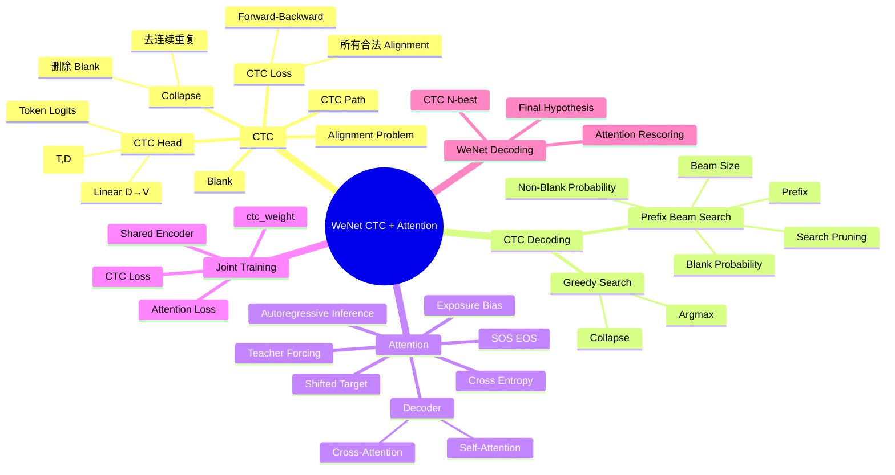

# WeNet 学习笔记（二）：CTC、联合训练与 Attention 解码

> 学习阶段：WeNet 前置核心知识  
> 本章目标：理解 WeNet 中 `Encoder → CTC / Attention Decoder → Loss → Decode` 的完整逻辑，并能回答常见 ASR 面试问题。

---

## 0. 本阶段总览

这一阶段我们已经从 WeNet Encoder 的输出一路学到了训练和解码：

```text
Fbank [B,T,80]
      ↓
Encoder
      ↓
encoder_out [B,T,D]
      │
      ├──────────────→ CTC Head → CTC Loss
      │                    ↓
      │              CTC Greedy Search
      │              CTC Prefix Beam Search
      │
      └──────────────→ Attention Decoder → Attention Loss
                                ↓
                         Attention Decoding
                                ↓
                         Attention Rescoring
```

核心认识：

1. CTC 解决「输入帧很长、文本很短、没有逐帧对齐标注」的问题。
2. CTC Head 本质更接近逐时间步分类头。
3. Attention Decoder 是具有序列建模能力的解码网络。
4. CTC 与 Attention 可以共享 Encoder，并进行联合训练。
5. WeNet 的经典解码方案可以先用 CTC Prefix Beam Search 得到 N-best，再用 Attention Decoder rescoring。

---

# 第一章：为什么 ASR 需要 CTC

## 1.1 输入和输出长度不一致

例如 1 秒语音使用约 10 ms frame shift：

```text
音频
↓
约 100 个声学时间步

文本
↓
"你好"
只有 2 个 token
```

训练数据通常只有：

```text
audio.wav
transcript = "你好"
```

并没有告诉模型：

```text
第 20~40 帧 = "你"
第 41~70 帧 = "好"
```

因此存在 **alignment（对齐）问题**。

CTC（Connectionist Temporal Classification）的重要作用：

> 不要求训练集提供逐帧对齐，只需要输入序列和目标文本序列，就能够训练模型。

---

# 第二章：CTC Blank 与 Collapse

CTC 在普通 token 之外增加特殊符号：

```text
blank
```

本文用 `_` 表示。

模型可能产生：

```text
_ _ 你 你 你 _ 好 好 _
```

CTC collapse 的基本过程：

### Step 1：合并连续重复 token

```text
_ _ 你 你 你 _ 好 好 _
↓
_ 你 _ 好 _
```

### Step 2：删除 blank

```text
_ 你 _ 好 _
↓
你 好
```

因此：

```text
B(_ _ 你 你 _ 好 好 _) = "你好"
```

其中 `B` 可以理解为 CTC collapse 操作。

---

## 2.1 为什么必须有 blank

目标：

```text
看看
```

如果路径为：

```text
看 看
```

合并连续重复后只剩：

```text
看
```

因此两个相同 token 之间需要被 blank 分隔：

```text
看 _ 看
↓
看看
```

这也是后续 CTC Prefix Beam Search 必须区分 blank / non-blank 概率的重要原因。

---

# 第三章：CTC Path 与 Alignment

假设目标文本：

```text
你好
```

以下路径都可能是合法 alignment：

```text
你 你 好 好
你 _ 好 _
_ 你 _ 好
你 _ _ 好
```

因为经过 CTC collapse 后都得到：

```text
你好
```

而：

```text
你 好 你
```

collapse 后仍然是：

```text
你好你
```

因此不是 `"你好"` 的合法 CTC path。

核心判断：

> 一条路径是否合法，不取决于路径本身长什么样，而取决于 `collapse(path) == target` 是否成立。

---

# 第四章：CTC Loss

CTC 不会规定唯一正确 alignment。

它会考虑所有能够 collapse 成目标文本的合法路径。

如果一条路径为：

```text
π = [你, 你, 好, 好]
```

可以直观理解其路径概率来自各时间步相应 token 概率的乘积。

目标文本 `"你好"` 的概率，则需要考虑所有合法 alignment：

```text
P("你好" | X)
=
所有 collapse 后等于 "你好" 的路径概率之和
```

CTC Loss：

```text
L_CTC = -log P(target | X)
```

因此训练目标可以理解成：

> 提高所有能够产生正确目标文本的合法 alignment 的总概率。

---

# 第五章：为什么需要 Forward-Backward 动态规划

真实 ASR 中可能存在：

```text
T = 数百 / 数千时间步
V = 数千 token
```

不可能枚举所有 frame-level paths。

CTC 因此利用动态规划高效计算合法 alignment 的总概率。

例如目标：

```text
你好
```

加入 blank：

```text
_ 你 _ 好 _
```

可以把它理解成状态序列：

```text
s0 s1 s2 s3 s4
 _  你  _  好  _
```

Forward probability：

```text
α(t,s)
```

表示：

> 到第 `t` 个时间步，并处于目标扩展序列状态 `s` 的所有合法路径概率总和。

---

## 5.1 三类状态转移

当前状态通常可能从以下位置获得概率：

```text
1. s   → s
2. s-1 → s
3. s-2 → s    （有条件）
```

第三种跳跃只有在满足 CTC 重复 token 规则时才允许。

例如：

```text
_ 你 _ 好 _
```

可以：

```text
你 → 好
```

因为两个 token 不同。

但是：

```text
_ 看 _ 看 _
```

不能直接：

```text
第一个"看" → 第二个"看"
```

否则无法正确表达重复 token。

---

## 5.2 为什么最终看最后两个状态

目标：

```text
_ 你 _ 好 _
        ↑   ↑
       s3  s4
```

完成 `"你好"` 时，最后可能：

```text
停在 "好"
```

或者：

```text
停在 "好" 后面的 blank
```

因此完整目标概率由这两类终止路径共同贡献。

---

# 第六章：CTC Head 到底是什么

假设 Encoder 输出：

```text
encoder_out.shape = [B, T, D]
```

例如：

```text
[32, 120, 256]
```

其中：

```text
32  = batch size
120 = 时间步
256 = Encoder hidden dimension
```

CTC Head 常见的核心操作：

```python
ctc_linear = nn.Linear(256, 4233)
ctc_logits = ctc_linear(encoder_out)
```

shape：

```text
[32,120,256]
      ↓
Linear(256,4233)
      ↓
[32,120,4233]
```

4233 表示 vocabulary size。

因此 CTC Head 的作用可以理解为：

> 把 Encoder 每一个时间步的声学表示投影到 vocabulary/token 空间。

---

## 6.1 Head 与 Decoder 的区别

### CTC Head

更接近：

```text
Encoder representation
↓
Linear
↓
token logits
```

自身通常不承担复杂的文本序列建模。

### Attention Decoder

输入通常包括：

```text
Encoder representation
+
已有文本 token
```

它自身还进行：

```text
Self-Attention
Cross-Attention
FFN
序列建模
```

因此：

| 对比 | CTC Head | Attention Decoder |
|---|---|---|
| 核心作用 | 时间步分类 / token projection | 序列生成与建模 |
| 历史 token | 不显式依赖 | 显式使用 |
| 结构复杂度 | 较低 | 较高 |
| 常见结构 | Linear 等 | Transformer Decoder 等 |
| 输出 | 每时间步 token score | 下一 token / 序列 score |

---

# 第七章：CTC Greedy Search

CTC logits：

```text
[B,T,V]
```

经过概率处理后，每一个时间步都有词表上的分数。

最简单的 Greedy Search：

```python
best_ids = torch.argmax(ctc_probs, dim=-1)
```

例如：

```text
_ _ 你 你 _ 好 好 _
```

然后：

```text
argmax
↓
token ids
↓
id → token
↓
collapse
↓
你好
```

核心：

> 每个时间步只选择当前概率最大的 token。

优点：

```text
简单
快速
```

缺点：

```text
局部最优 ≠ 整个序列全局最优
```

---

# 第八章：CTC Prefix Beam Search

Beam Search 不再只保留 Top-1。

例如：

```text
beam_size = 10
```

意味着搜索过程中保留若干最有希望的候选。

核心思想：

```text
Greedy
每一步只留一个

Beam Search
每一步保留 Top-K
```

beam size 越大：

```text
潜在搜索质量 ↑
计算量 ↑
```

beam size 越小：

```text
速度 ↑
搜索空间 ↓
可能提前剪掉正确候选
```

这里的「剪枝」是：

```text
Search Pruning
```

不是模型压缩中的 Model Pruning。

### Search Pruning

剪：

```text
候选路径 / prefix
```

### Model Pruning

剪：

```text
参数
神经元
Attention Head
Channel
Layer
```

两者不是同一个概念。

---

# 第九章：为什么 Prefix Beam Search 要维护 blank / non-blank

假设 prefix：

```text
"看"
```

它可能来自：

```text
看 _
```

也可能来自：

```text
看 看
```

两者 collapse 后都是：

```text
看
```

但下一帧再出现 `"看"` 时：

```text
看 _ 看
↓
看看
```

而：

```text
看 看 看
↓
看
```

行为完全不同。

因此 CTC Prefix Beam Search 通常需要区分：

```text
p_blank(prefix)
p_non_blank(prefix)
```

---

## 9.1 三种扩展情况

### 下一 token 是 blank

```text
prefix 不增加字符
```

### 下一 token 与 prefix 最后 token 相同

需要判断之前是否以 blank 结束。

```text
看 _ + 看
→ 看看
```

而：

```text
看 看 + 看
→ 看
```

### 下一 token 是不同 token

例如：

```text
看 + 好
→ 看好
```

可以正常扩展 prefix。

---

# 第十章：Attention Rescoring

CTC Prefix Beam Search 可以先生成：

```text
N-best hypotheses
```

例如：

```text
今天下雨
今天夏雨
今天下语
...
```

然后 Attention Decoder 根据：

```text
Encoder acoustic representation
+
candidate sequence
```

重新为候选打分。

流程：

```text
Encoder
↓
CTC Prefix Beam Search
↓
N-best
↓
Attention Decoder Rescoring
↓
重新排序
↓
最终结果
```

WeNet 官方 runtime 对 U2 的描述就是：流式阶段利用 shared encoder + CTC activation + CTC prefix beam search 产生候选；输入结束后，再将 N-best 与 encoder outputs 送入 Attention Decoder 打分并选择最终结果。

WeNet 官方示例也提供：

```text
ctc_greedy_search
ctc_prefix_beam_search
attention
attention_rescoring
```

四种常见解码模式。

---

# 第十一章：CTC + Attention 联合训练

经典结构：

```text
                     Encoder
                        │
              ┌─────────┴─────────┐
              ↓                   ↓
          CTC Head        Attention Decoder
              ↓                   ↓
          loss_ctc            loss_att
              └─────────┬─────────┘
                        ↓
                    total loss
```

常见形式：

```text
L = λ L_CTC + (1-λ) L_Att
```

例如：

```text
ctc_weight = 0.3
```

意味着：

```text
0.3 × CTC Loss
+
0.7 × Attention Loss
```

WeNet 当前 AISHELL2 unified Conformer 配置中可以看到 `ctc_weight: 0.3`，并使用 80-bin FBank、25 ms frame length、10 ms frame shift。

---

## 11.1 两个 Loss 到底训练谁

### CTC Loss

计算路径：

```text
Encoder
↓
CTC Head
↓
CTC Loss
```

因此梯度可以更新：

```text
CTC Head
+
Encoder
```

### Attention Loss

计算路径：

```text
Encoder
↓
Attention Decoder
↓
Attention Loss
```

因此梯度可以更新：

```text
Attention Decoder
+
Encoder
```

所以：

```text
CTC Head
← 主要接受 CTC Loss 梯度

Attention Decoder
← 主要接受 Attention Loss 梯度

Encoder
← 同时接受两边的训练信号
```

前提是这些参数没有被冻结。

---

# 第十二章：Attention Decoder 如何训练

假设 target：

```text
你好
```

训练时构造：

```text
Decoder Input:
<sos> 你 好

Decoder Target:
你 好 <eos>
```

也就是 shifted target。

Decoder 学习：

```text
<sos>
→ 你

<sos> 你
→ 好

<sos> 你 好
→ <eos>
```

这就是 Teacher Forcing 的基本思想：

> 训练时使用正确历史 token 作为 Decoder 的条件。

---

## 12.1 Self-Attention 与 Cross-Attention

Attention Decoder 中要区分：

### Self-Attention

关注：

```text
已经出现的文本 token
```

例如：

```text
<sos> 我 爱 北
```

预测后续 token。

训练时通常需要 causal mask，防止模型偷看未来 token。

### Cross-Attention

关注：

```text
Encoder acoustic representation
```

可以理解成：

> Decoder 在生成当前 token 时，从语音 Encoder 输出中寻找相关声学证据。

所以：

```text
Self-Attention
→ 文本上下文

Cross-Attention
→ 声学信息
```

---

# 第十三章：Attention Loss

Attention Decoder 每个位置最终产生：

```text
V 个 token logits
```

训练时目标 token 已知，因此可以与 target 做 Cross Entropy。

例如：

```text
正确 token = "北"
```

训练目标就是提高：

```text
P("北" | encoder_out, previous_tokens)
```

所以：

```text
Decoder logits
↓
Cross Entropy
↓
loss_att
```

这与 CTC Loss 的 alignment marginalization 机制完全不同。

---

# 第十四章：Attention 推理与 Teacher Forcing 的差异

训练：

```text
使用正确前文
```

推理：

```text
没有正确答案
```

所以推理时：

```text
<sos>
↓
模型预测 "你"

<sos> 你
↓
模型预测 "好"

<sos> 你 好
↓
模型预测 <eos>
```

模型把自己前一步预测结果作为下一步输入。

这叫：

```text
Autoregressive Decoding
```

因此训练和推理存在差异：

```text
训练：看到 ground-truth history
推理：看到 model-generated history
```

这与 exposure bias 有关。

---

# 第十五章：整个 WeNet ASR 主线

现在可以把本阶段与上一阶段 FBank 连起来：

```text
wav
↓
分帧 / 加窗 / FFT
↓
80-dim Log-Mel FBank
[B,T,80]
↓
Conformer / Transformer Encoder
[B,T,D]
↓
共享 Encoder Representation
│
├──────────────────────────┐
↓                          ↓
CTC Head             Attention Decoder
Linear(D,V)          Self-Attention
↓                    Cross-Attention
CTC Loss             Cross Entropy
│                          │
└─────────────┬────────────┘
              ↓
          Joint Training
```

推理：

```text
Encoder
↓
CTC Prefix Beam Search
↓
N-best
↓
Attention Rescoring
↓
最终文本
```

这已经非常接近 WeNet U2/U2++ 的核心思路。

---

# 第十六章：必须能自己写的最小代码

## 16.1 CTC Head

```python
import torch
import torch.nn as nn

ctc_linear = nn.Linear(256, 4233)
ctc_logits = ctc_linear(encoder_out)
```

shape：

```text
[B,T,256]
↓
[B,T,4233]
```

---

## 16.2 Greedy Argmax

```python
best_ids = torch.argmax(ctc_probs, dim=-1)
```

---

## 16.3 CTC Collapse

这一段建议必须能够自己重新写出来，而不是复制：

```python
def ctc_collapse(tokens):
    result = []
    prev = None

    for token in tokens:
        if token != prev:
            result.append(token)
        prev = token

    final = []

    for token in result:
        if token != "_":
            final.append(token)

    return final
```

---

## 16.4 判断合法 CTC Path

```python
def is_valid_ctc_path(path, target):
    return ctc_collapse(path) == target
```

后续进入 WeNet 源码时，应继续练习：

```text
Tensor shape tracing
nn.Module / forward
mask
length
loss
decode
```

不能只停留在“会调用现成 API”。

---

# 第十七章：面试题（与本章知识一一对应）

> 以下问题结合常见 ASR 面试考点整理，并用 WeNet 官方实现/配置核对关键事实。重点不是背答案，而是能用自己的语言解释。

## Q1：CTC 解决什么问题？

回答要点：

- 输入声学序列长度 `T` 通常远大于文本长度 `U`。
- 训练集通常没有 frame-level alignment。
- CTC 通过 blank、重复 token、alignment marginalization，在不需要逐帧标注的情况下训练序列映射。

---

## Q2：CTC 为什么需要 blank？

回答要点：

1. 表示某时间步没有输出新的标签。
2. 支持不同长度的 alignment。
3. 分隔连续相同 token。

例：

```text
看 _ 看 → 看看
```

---

## Q3：CTC 的条件独立假设是什么？有什么局限？

回答要点：

- 给定 Encoder 表示后，CTC 输出层对不同时间步的标签预测采用较强的条件独立假设。
- CTC 本身不显式利用历史输出 token 做自回归序列建模。
- 因此通常需要强 Encoder，也可以与 Attention Decoder / LM 等结合改善序列建模。

---

## Q4：CTC Greedy Search 和 Prefix Beam Search 有什么区别？

回答要点：

```text
Greedy:
每帧 Top-1 → collapse
```

```text
Prefix Beam Search:
维护多个文本前缀
+ 合并不同 alignment 的概率
+ 搜索剪枝
```

后者搜索更充分，但计算成本更高。

WeNet 官方教程明确提供这两种 decoding mode，并指出较大的 beam size 可能改善结果，同时增加计算开销。

---

## Q5：为什么 CTC Prefix Beam Search 要维护 blank / non-blank probability？

回答核心例子：

```text
看 _ 看 → 看看
看 看 看 → 看
```

虽然中间某时刻 collapse 后 prefix 都可能是 `"看"`，但下一步遇到相同 token 时行为不同，因此不能完全合并状态。

---

## Q6：Beam Search 的“剪枝”和模型剪枝一样吗？

不一样。

```text
Beam Search pruning
→ 剪搜索候选
```

```text
Model pruning
→ 剪模型参数/结构
```

前者主要改变解码搜索复杂度，后者改变模型本身。

---

## Q7：CTC Head 和 Attention Decoder 有什么区别？

回答要点：

CTC Head：

```text
Encoder → Linear → vocabulary logits
```

主要负责将 Encoder 表示投影到 token 空间。

Attention Decoder：

```text
Encoder representation
+
previous tokens
↓
sequence modeling
```

通常具有 Self-Attention、Cross-Attention 等模块，本身具备更强序列建模能力。

---

## Q8：为什么 WeNet 使用 CTC + Attention 联合训练？

回答要点：

- CTC 提供强单调对齐约束。
- Attention Decoder 显式建模 token 之间的上下文依赖。
- 两者共享 Encoder。
- Encoder 同时获得 CTC 与 Attention 两种训练信号。

WeNet 的官方配置中可以直接看到 hybrid CTC/attention 与 `ctc_weight`。

---

## Q9：`ctc_weight = 1` 和 `ctc_weight = 0` 分别意味着什么？

在基本联合 loss 表达下：

```text
ctc_weight = 1
→ 只使用 CTC loss
```

```text
ctc_weight = 0
→ 只使用 Attention loss
```

具体代码仍应结合对应 WeNet 版本确认边界行为。

---

## Q10：CTC Loss 会更新 Decoder 吗？

通常不会。

CTC Loss 路径：

```text
CTC Loss
↓
CTC Head
↓
Encoder
```

没有经过 Attention Decoder，因此不会由该 loss 给 Decoder 参数提供梯度。

Attention Loss 则会更新：

```text
Attention Decoder
+
Encoder
```

---

## Q11：Teacher Forcing 是什么？

训练 Decoder 时使用 ground-truth previous tokens。

例如 target：

```text
你好
```

构造：

```text
input  = <sos> 你 好
target = 你 好 <eos>
```

训练 Decoder 学习 next-token prediction。

---

## Q12：Teacher Forcing 的训练和推理有什么差异？

训练：

```text
ground-truth history
```

推理：

```text
model-generated history
```

这种差异会带来 exposure bias。

---

## Q13：Transformer Decoder 中 Self-Attention 和 Cross-Attention 的区别？

```text
Self-Attention
→ 建模文本 token 之间的关系
```

```text
Cross-Attention
→ Decoder 查询 Encoder 的声学表示
```

---

## Q14：什么是 Attention Rescoring？

回答：

1. CTC Prefix Beam Search 产生 N-best。
2. 将候选和 Encoder outputs 交给 Attention Decoder。
3. Attention Decoder 为候选重新打分。
4. 综合分数选择最终结果。

WeNet 官方 U2 runtime 正是描述了这一流程。

---

## Q15：为什么不直接使用 Attention Decoder 做完整 beam search？

可以做，但 WeNet U2 的核心工程思路之一是：

```text
CTC Prefix Beam Search
→ 快速产生候选

Attention Decoder
→ second-pass rescoring
```

官方 runtime 文档指出，这种 attention-rescoring based decoding 相比传统 autoregressive beam search 更快，并且能够统一流式和非流式使用方式。

---

## Q16：`[B,T,D] → [B,T,V]` 是什么意思？

例如：

```text
[32,120,256]
↓ Linear(256,4233)
[32,120,4233]
```

说明：

```text
B = batch
T = acoustic time steps
D = encoder hidden dimension
V = vocabulary size
```

Linear 主要改变最后一个特征维度，不改变 batch 和时间维。

---

## Q17：为什么 `softmax(..., dim=-1)`？

因为：

```text
[B,T,V]
     ↑
```

最后一维是 vocabulary。

希望每个样本的每个时间步在 `V` 个 token 上形成概率分布。

---

# 第十八章：WeNet 官方配置中的真实对应

以当前官方 AISHELL2 unified Conformer 配置为例，可以看到：

```text
fbank:
num_mel_bins = 80
frame_shift = 10 ms
frame_length = 25 ms

decoder = transformer

ctc = ctc

model = asr_model
ctc_weight = 0.3
```

因此前两阶段学的：

```text
Waveform
→ FBank
→ Encoder
→ CTC / Attention
```

不是抽象教材知识，而是直接对应 WeNet 的实际配置。

WeNet 官方 WenetSpeech recipe 也直接列出了：

```text
ctc_greedy_search
ctc_prefix_beam_search
attention
attention_rescoring
```

四种 decode modes。

---

# 第十九章：思维导图



---

# 第二十章：一张图记住全部

```text
                           TRAINING

wav
 ↓
Log-Mel FBank
[B,T,80]
 ↓
Encoder
[B,T,D]
 │
 ├────────────────────────────┐
 │                            │
 ▼                            ▼
CTC Head                Attention Decoder
Linear(D,V)             Encoder + target history
 │                            │
 ▼                            ▼
CTC Loss                 Cross Entropy
 │                            │
 └──────────────┬─────────────┘
                ▼
             Joint Loss
                │
                ▼
        Backpropagation
        ├─ Encoder
        ├─ CTC Head
        └─ Decoder


                           INFERENCE

wav
 ↓
FBank
 ↓
Encoder
 ↓
CTC Prefix Beam Search
 ↓
N-best hypotheses
 ↓
Attention Decoder Rescoring
 ↓
Final Transcript
```

---

# 第二十一章：本阶段验收标准

进入下一阶段前，应该能够不看笔记解释：

- [ ] CTC 为什么不需要逐帧 alignment。
- [ ] blank 为什么存在。
- [ ] CTC collapse 的两步是什么。
- [ ] 为什么 `"看看"` 需要 blank 分隔。
- [ ] CTC Loss 为什么要累加多条 alignment。
- [ ] Forward 动态规划解决了什么计算问题。
- [ ] CTC Head 为什么通常比 Decoder 简单。
- [ ] `[B,T,D] → [B,T,V]` 每一维是什么。
- [ ] Greedy 与 Prefix Beam Search 的区别。
- [ ] Prefix Beam Search 为什么区分 blank/non-blank。
- [ ] beam pruning 与 model pruning 的区别。
- [ ] CTC Loss 和 Attention Loss 分别更新哪些模块。
- [ ] Teacher Forcing、`<sos>`、`<eos>` 是什么。
- [ ] Self-Attention 与 Cross-Attention 的区别。
- [ ] Attention Rescoring 的完整流程。
- [ ] 为什么 WeNet 使用 CTC + Attention 联合训练。

---

# 下一阶段

下一阶段建议进入：

```text
Transformer
↓
Self-Attention / QKV
↓
Multi-Head Attention
↓
FFN / Residual / LayerNorm
↓
Conformer
↓
正式阅读 WeNet Encoder 源码
```

届时重点不再只是概念，而是开始自己追：

```text
tensor shape
forward()
mask
subsampling
attention
convolution module
```

---

## 参考资料

- WeNet 官方 GitHub：`wenet-e2e/wenet`
- WeNet 官方 Runtime 文档：U2 shared encoder、CTC prefix beam search、attention rescoring
- WeNet 官方 AISHELL / AISHELL2 / WenetSpeech recipes
- DataXujing ASR-paper 学习笔记

> 面试题部分以公开常见 ASR 面试考点为题型来源，并优先使用 WeNet 官方代码、配置和文档核对技术事实；不要把任何单一“面经答案”当作标准答案。
