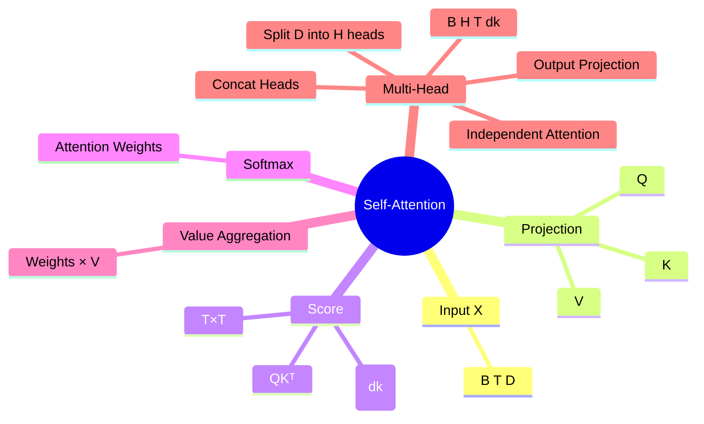

# Day 3：Transformer、Self-Attention 与 Multi-Head Attention

> 当前进度：已完成 Self-Attention 数学变化与 Multi-Head Attention 的 shape 数据流；下一节进入 Residual、LayerNorm、FFN 与 WeNet Conformer 源码。

## 1. Self-Attention 为什么存在

对于 Encoder 中间表示：

```text
X.shape = [B, T, D]
```

Self-Attention 允许每个时间位置根据内容主动聚合其他时间位置的信息，而不是只能依赖固定局部窗口。

核心公式：

$$
\operatorname{Attention}(Q,K,V)=\operatorname{softmax}\left(\frac{QK^T}{\sqrt{d_k}}\right)V
$$

其中：

- `Q`：Query，我当前想找什么；
- `K`：Key，我用什么特征被匹配；
- `V`：Value，真正被读取并融合的信息。

## 2. Q、K、V 如何得到

同一个输入 `X` 经过三套独立可训练线性投影：

$$
Q=XW_Q,\quad K=XW_K,\quad V=XW_V
$$

例如：

```text
X: [100, 512]
Wq: 512 → 128
Wk: 512 → 128
Wv: 512 → 64

Q: [100, 128]
K: [100, 128]
V: [100, 64]
d_k = 128
```

这里 `d_k` 是 Q/K 用于点积匹配的维度，不一定等于模型总 hidden size `D`。

## 3. Attention Score Matrix 的数学变化

如果：

```text
Q: [T, d_k]
K: [T, d_k]
```

则：

```text
Q @ K.T
[T,d_k] @ [d_k,T]
→ [T,T]
```

`[T,T]` 表示所有 Query 时间位置与所有 Key 时间位置之间的匹配分数。

比如：

```text
scores[30, 80]
```

表示第 30 个 Query 位置和第 80 个 Key 位置的相关性分数。

## 4. 为什么除以 sqrt(d_k)

点积：

$$
q\cdot k=q_1k_1+q_2k_2+\cdots+q_{d_k}k_{d_k}
$$

随着 `d_k` 增大，点积数值波动通常变大，容易使 softmax 过度尖锐并影响梯度稳定性。

因此使用：

$$
\frac{QK^T}{\sqrt{d_k}}
$$

来控制 score 的数值尺度。

## 5. Softmax 与 Value 聚合

令：

$$
A=\operatorname{softmax}\left(\frac{QK^T}{\sqrt{d_k}}\right)
$$

其中：

```text
A.shape = [T,T]
```

每一行的权重和为 1。

随后：

$$
O=AV
$$

如果：

```text
A: [T,T]
V: [T,d_v]
```

则：

```text
O: [T,d_v]
```

一句话记忆：

> Q 和 K 决定“看谁”，V 决定“拿什么”。

## 6. Multi-Head Attention 为什么需要多头

单头 Attention 只有一套 Q/K/V 表示空间。多头 Attention 将总体表示预算拆成多个子空间，使模型能够并行学习不同类型的关系。

这些模式不是人为指定的，而是由训练目标通过反向传播学习得到。

## 7. Multi-Head Attention 的关键 shape

假设：

```text
B = 16
T = 200
D = 512
H = 8
```

则：

$$
d_k = D/H = 64
$$

经过 Q/K/V 投影：

```text
Q,K,V: [16,200,512]
```

拆 head：

```text
[B,T,D]
→ [B,T,H,d_k]
→ [16,200,8,64]
```

交换 head 和 time：

```text
[16,200,8,64]
→ [16,8,200,64]
```

所以：

```text
Q,K,V: [B,H,T,d_k]
```

## 8. 每个 Head 独立计算 Attention

```text
Q:   [B,H,T,d_k]
K.T: [B,H,d_k,T]

Q @ K.T
→ [B,H,T,T]
```

所以每个 Head 都有一张自己的 `T × T` Attention Matrix。

例如：

```text
scores[0,3,20,80]
```

表示：第 0 条语音、第 3 个 head 中，第 20 个 Query 时间位置和第 80 个 Key 时间位置的 score。

每个 head 的缩放因子使用：

$$
\sqrt{d_k}=\sqrt{64}=8
$$

而不是 `sqrt(512)`。

## 9. 多个 Head 如何重新拼回 D 维

每个 head 得到：

```text
[B,H,T,d_k]
```

先转回：

```text
[B,H,T,d_k]
→ transpose
[B,T,H,d_k]
```

再 concat / reshape：

```text
[B,T,H,d_k]
→ [B,T,H*d_k]
→ [B,T,D]
```

例如：

```text
[16,8,200,64]
→ [16,200,8,64]
→ [16,200,512]
```

最后通常还经过输出投影：

```python
out_proj = nn.Linear(512, 512)
```

即：

$$
\operatorname{MultiHead}(Q,K,V)=\operatorname{Concat}(head_1,\dots,head_H)W_O
$$

## 10. `view`、`transpose`、`contiguous` 的区别

`view/reshape` 用于重新组织 shape，例如：

```python
q = q.view(B, T, H, d_k)
```

把：

```text
[B,T,512]
```

组织为：

```text
[B,T,8,64]
```

`transpose` 用于交换维度：

```python
q = q.transpose(1, 2)
```

把：

```text
[B,T,H,d_k]
```

变成：

```text
[B,H,T,d_k]
```

由于 `transpose` 可能产生非连续内存视图，经典代码中常见：

```python
x = x.transpose(1, 2).contiguous().view(B, T, D)
```

## 11. 最小多头 Shape 代码

```python
import torch
import torch.nn as nn

B, T, D, H = 16, 200, 512, 8
d_k = D // H

x = torch.randn(B, T, D)

q_proj = nn.Linear(D, D)
k_proj = nn.Linear(D, D)
v_proj = nn.Linear(D, D)

q = q_proj(x)
k = k_proj(x)
v = v_proj(x)

q = q.view(B, T, H, d_k).transpose(1, 2)
k = k.view(B, T, H, d_k).transpose(1, 2)
v = v.view(B, T, H, d_k).transpose(1, 2)

# q/k/v: [B,H,T,d_k]
```

## 12. 与 WeNet 配置的对应

WeNet 官方 Conformer recipe 会配置：

```yaml
encoder: conformer
encoder_conf:
    output_size: 512
    attention_heads: 8
```

此时：

```text
D = 512
H = 8
d_k = 64
```

下一步我们会直接读取 WeNet 当前源码中的 Attention / Conformer Encoder 实现，而不只讲教材版结构。

## 13. 思维导图



## 14. 本节验收

- [ ] 能解释 Q/K/V 各自的角色。
- [ ] 知道 `d_k` 的来源。
- [ ] 能推导 `[T,d_k] @ [d_k,T] → [T,T]`。
- [ ] 知道为什么要除 `sqrt(d_k)`。
- [ ] 能解释 `[T,T]` Attention Matrix 的语义。
- [ ] 能解释为什么最终乘的是 V 而不是 K。
- [ ] 能追踪 `[B,T,D] → [B,H,T,d_k] → [B,T,D]`。
- [ ] 能区分 `view/reshape` 和 `transpose`。

## 下一节

```text
Residual Connection
↓
LayerNorm
↓
FFN
↓
Transformer Encoder Block
↓
Conformer Block
↓
WeNet 当前源码
```
