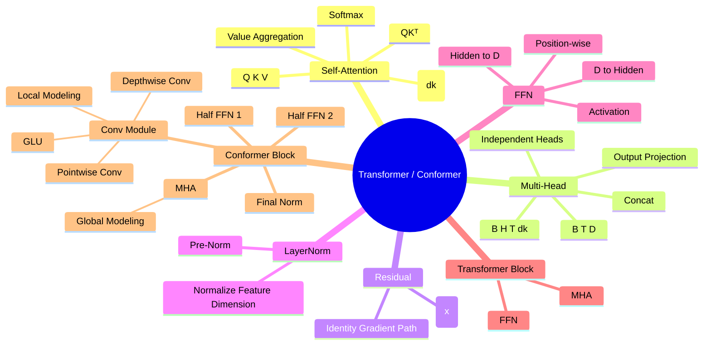

# Day 3：Transformer、Self-Attention 与 Conformer Block

> 当前进度：已完成 Self-Attention、Multi-Head Attention、Residual、Pre-Norm、LayerNorm、FFN，并开始直接阅读 WeNet 的 `TransformerEncoderLayer`、`ConformerEncoderLayer` 与 `ConvolutionModule` 源码。下一节进入 Positional Encoding / Relative Position Attention。

## 1. Self-Attention 为什么存在

对于 Encoder 中间表示：

```text
X.shape = [B, T, D]
```

Self-Attention 允许每个时间位置根据内容主动聚合其他时间位置的信息，而不是只能依赖固定局部窗口。

核心公式：

$$
\operatorname{Attention}(Q,K,V)=\operatorname{softmax}\left(\frac{QK^T}{\sqrt{d_k}}\right)V
$$

其中：

- `Q`：Query，我当前想找什么；
- `K`：Key，我用什么特征被匹配；
- `V`：Value，真正被读取并融合的信息。

## 2. Q、K、V 如何得到

同一个输入 `X` 经过三套独立可训练线性投影：

$$
Q=XW_Q,\quad K=XW_K,\quad V=XW_V
$$

例如：

```text
X: [100, 512]
Wq: 512 → 128
Wk: 512 → 128
Wv: 512 → 64

Q: [100, 128]
K: [100, 128]
V: [100, 64]
d_k = 128
```

这里 `d_k` 是 Q/K 用于点积匹配的维度，不一定等于模型总 hidden size `D`。

## 3. Attention Score Matrix 的数学变化

如果：

```text
Q: [T, d_k]
K: [T, d_k]
```

则：

```text
Q @ K.T
[T,d_k] @ [d_k,T]
→ [T,T]
```

`[T,T]` 表示所有 Query 时间位置与所有 Key 时间位置之间的匹配分数。

例如：

```text
scores[30, 80]
```

表示第 30 个 Query 位置和第 80 个 Key 位置的相关性分数。

## 4. 为什么除以 sqrt(d_k)

点积：

$$
q\cdot k=q_1k_1+q_2k_2+\cdots+q_{d_k}k_{d_k}
$$

随着 `d_k` 增大，点积数值波动通常变大，容易使 softmax 过度尖锐并影响梯度稳定性。

因此使用：

$$
\frac{QK^T}{\sqrt{d_k}}
$$

来控制 score 的数值尺度。

## 5. Softmax 与 Value 聚合

令：

$$
A=\operatorname{softmax}\left(\frac{QK^T}{\sqrt{d_k}}\right)
$$

其中：

```text
A.shape = [T,T]
```

每一行的权重和为 1。

随后：

$$
O=AV
$$

如果：

```text
A: [T,T]
V: [T,d_v]
```

则：

```text
O: [T,d_v]
```

一句话记忆：

> Q 和 K 决定“看谁”，V 决定“拿什么”。

## 6. Multi-Head Attention 为什么需要多头

单头 Attention 只有一套 Q/K/V 表示空间。多头 Attention 将总体表示预算拆成多个子空间，使模型能够并行学习不同类型的关系。

这些模式不是人为指定的，而是由训练目标通过反向传播学习得到。

## 7. Multi-Head Attention 的关键 shape

假设：

```text
B = 16
T = 200
D = 512
H = 8
```

则：

$$
d_k = D/H = 64
$$

经过 Q/K/V 投影：

```text
Q,K,V: [16,200,512]
```

拆 head：

```text
[B,T,D]
→ [B,T,H,d_k]
→ [16,200,8,64]
```

交换 head 和 time：

```text
[16,200,8,64]
→ [16,8,200,64]
```

因此：

```text
Q,K,V: [B,H,T,d_k]
```

## 8. 每个 Head 独立计算 Attention

```text
Q:   [B,H,T,d_k]
K.T: [B,H,d_k,T]

Q @ K.T
→ [B,H,T,T]
```

所以每个 Head 都有一张自己的 `T × T` Attention Matrix。

例如：

```text
scores[0,3,20,80]
```

表示：第 0 条语音、第 3 个 head 中，第 20 个 Query 时间位置和第 80 个 Key 时间位置的 score。

每个 head 的缩放因子使用：

$$
\sqrt{d_k}=\sqrt{64}=8
$$

而不是 `sqrt(512)`。

## 9. 多个 Head 如何重新拼回 D 维

每个 head 得到：

```text
[B,H,T,d_k]
```

先转回：

```text
[B,H,T,d_k]
→ transpose
[B,T,H,d_k]
```

再 concat / reshape：

```text
[B,T,H,d_k]
→ [B,T,H*d_k]
→ [B,T,D]
```

例如：

```text
[16,8,200,64]
→ [16,200,8,64]
→ [16,200,512]
```

最后经过输出投影：

$$
\operatorname{MultiHead}(Q,K,V)=\operatorname{Concat}(head_1,\dots,head_H)W_O
$$

## 10. `view`、`transpose`、`contiguous` 的区别

```python
q = q.view(B, T, H, d_k)
q = q.transpose(1, 2)
```

表示：

```text
[B,T,D]
→ [B,T,H,d_k]
→ [B,H,T,d_k]
```

`transpose()` 可能产生非连续内存视图，因此经典代码中常见：

```python
x = x.transpose(1, 2).contiguous().view(B, T, D)
```

学习阶段可以先记：

- `view/reshape`：重新组织 shape；
- `transpose`：交换维度；
- `contiguous`：在 `transpose + view` 之间经常用于重新整理连续内存。

## 11. Multi-Head Attention 完整 shape 链

```text
X
[B,T,D]

↓ Q/K/V Linear

[B,T,D]

↓ split heads

[B,T,H,d_k]

↓ transpose

[B,H,T,d_k]

↓ QKᵀ / sqrt(d_k) / softmax / @V

[B,H,T,d_k]

↓ transpose back

[B,T,H,d_k]

↓ concat / reshape

[B,T,D]

↓ output projection W_O

[B,T,D]
```

输入输出 hidden size 保持一致，为后续 residual connection 提供条件。

---

# Part 2：Residual、LayerNorm 与 FFN

## 12. Residual Connection

残差连接：

$$
y=x+F(x)
$$

可以理解成：

```text
旧表示 x
+
这一层学到的修正量 F(x)
=
新的表示 y
```

如果输入与模块输出都是：

```text
[B,T,D]
```

就可以直接逐元素相加。

### 梯度为什么更容易传播

因为：

$$
y=x+F(x)
$$

所以：

$$
\frac{\partial y}{\partial x}=1+\frac{\partial F(x)}{\partial x}
$$

反向传播中存在一条 identity path。深层网络不必让梯度完全依赖多个复杂模块的 Jacobian 连乘。

因此 Residual 对深层 Transformer / Conformer 的稳定训练非常重要。

## 13. Pre-Norm 与 Post-Norm

### Post-Norm

$$
y=LN(x+F(x))
$$

流程：

```text
x → F(x) → Add Residual → LayerNorm
```

### Pre-Norm

$$
y=x+F(LN(x))
$$

流程：

```text
x ─────────────────────┐
↓                      │
LayerNorm              │
↓                      │
F                      │
↓                      │
Add  ←─────────────────┘
```

WeNet 的 `TransformerEncoderLayer` / `ConformerEncoderLayer` 都通过：

```python
normalize_before = True
```

支持 Pre-Norm 路径。

源码位置：

```text
wenet/models/transformer/encoder_layer.py
```

核心模式就是：

```python
residual = x
if self.normalize_before:
    x = self.norm1(x)

x_att, ... = self.self_attn(...)
x = residual + self.dropout(x_att)
```

应当直接翻译成：

$$
x \leftarrow x + Attention(LN(x))
$$

## 14. LayerNorm 到底归一化什么

输入：

```text
x.shape = [B,T,D]
```

LayerNorm 通常对最后一个特征维 `D` 做归一化。

对于某一个时间位置的 D 维特征：

$$
\mu=\frac1D\sum_i x_i
$$

$$
\sigma^2=\frac1D\sum_i(x_i-\mu)^2
$$

$$
\hat{x}_i=\frac{x_i-\mu}{\sqrt{\sigma^2+\epsilon}}
$$

最终还有可训练参数：

$$
y_i=\gamma_i\hat{x}_i+\beta_i
$$

PyTorch：

```python
norm = nn.LayerNorm(256)
```

shape 不变：

```text
[16,200,256]
→ [16,200,256]
```

## 15. FFN：每个位置独立加工特征

WeNet 源码：

```text
wenet/models/transformer/positionwise_feed_forward.py
```

核心实现：

```python
self.w_1 = torch.nn.Linear(idim, hidden_units)
self.activation = activation
self.dropout = torch.nn.Dropout(dropout_rate)
self.w_2 = torch.nn.Linear(hidden_units, idim)
```

forward：

```python
return self.w_2(
    self.dropout(
        self.activation(
            self.w_1(xs)
        )
    )
)
```

例如：

```text
[B,T,256]
↓ Linear(256,2048)
[B,T,2048]
↓ activation / dropout
[B,T,2048]
↓ Linear(2048,256)
[B,T,256]
```

FFN 不改变 `T`，而且不同时间步在这一步基本不互相通信。

一句话：

- Self-Attention：时间位置之间交换信息；
- FFN：每个时间位置内部加工 feature。

---

# Part 3：WeNet Transformer Encoder Block

## 16. `TransformerEncoderLayer.forward()`

WeNet 当前源码：

```text
wenet/models/transformer/encoder_layer.py
```

核心可以压缩为：

```python
# Attention sub-block
residual = x
x = norm1(x)
x_att = self_attn(x, x, x, ...)
x = residual + dropout(x_att)

# FFN sub-block
residual = x
x = norm2(x)
x = residual + dropout(feed_forward(x))
```

数学上：

$$
x_1=x_0+MHA(LN(x_0))
$$

$$
x_2=x_1+FFN(LN(x_1))
$$

结构：

```text
x0
 │
 ▼
LayerNorm
 │
 ▼
Multi-Head Self-Attention
 │
 ▼
Dropout
 │
 + ←──────── x0
 │
 ▼
x1
 │
 ▼
LayerNorm
 │
 ▼
FFN
 │
 ▼
Dropout
 │
 + ←──────── x1
 │
 ▼
x2
```

---

# Part 4：WeNet Conformer Encoder Block

## 17. Conformer 比 Transformer 多了什么

普通 Transformer Encoder：

```text
MHA
↓
FFN
```

WeNet 的 `ConformerEncoderLayer` 实际顺序：

```text
0.5 × Macaron FFN
↓
Multi-Head Self-Attention
↓
Convolution Module
↓
0.5 × FFN
↓
Final Norm
```

源码位置：

```text
wenet/models/transformer/encoder_layer.py
```

每个子模块仍然围绕：

```text
Pre-Norm + Residual
```

组织。

## 18. 为什么 Conformer 要加入 CNN

语音既需要：

```text
长距离 / 全局依赖
```

也需要：

```text
相邻帧局部连续结构
```

因此：

- MHA：负责全局时间关系；
- Conv Module：负责局部时间关系；
- FFN：负责每个时间位置内部的特征变换。

这三类模块的分工是理解 Conformer 的核心。

## 19. WeNet `ConvolutionModule` 的真实流程

源码：

```text
wenet/models/transformer/convolution.py
```

输入：

```text
[B,T,D]
```

PyTorch `Conv1d` 需要：

```text
[B,Channels,Length]
```

因此源码先：

```python
x = x.transpose(1, 2)
```

得到：

```text
[B,D,T]
```

随后真实流程：

```text
[B,T,D]
↓ transpose
[B,D,T]
↓
Pointwise Conv 1×1
↓
GLU
↓
Depthwise Conv 1D
↓
Norm
↓
Activation
↓
Pointwise Conv 1×1
↓ transpose back
[B,T,D]
```

## 20. Pointwise Conv 的作用

源码首先使用：

```python
nn.Conv1d(
    channels,
    2 * channels,
    kernel_size=1,
)
```

`kernel_size=1` 不负责大范围时间建模，主要作用是进行 channel / feature 维的投影与混合。

如果：

```text
D = 256
```

则可以理解成：

```text
[B,256,T]
→ [B,512,T]
```

## 21. GLU：门控信息

Pointwise Conv 后通过 GLU。

假设得到：

```text
[B,512,T]
```

分成：

```text
A: [B,256,T]
B: [B,256,T]
```

GLU：

$$
GLU(A,B)=A\odot \sigma(B)
$$

其中 `sigmoid(B)` 像 gate：

- 接近 0：抑制对应信息；
- 接近 1：允许对应信息通过。

输出重新回到：

```text
[B,256,T]
```

## 22. Depthwise Conv：真正负责局部时间建模

WeNet 使用 depthwise 1D convolution，并通过 `groups=channels` 形式让各 channel 独立沿时间卷积。

因此：

```text
Pointwise Conv
→ channel mixing

Depthwise Conv
→ local temporal modeling
```

这是 Conformer 中高效局部建模的核心。

如果 kernel size 约为 31，结合 10 ms 级 frame shift，可以粗略理解为一次卷积关注几百毫秒量级的局部时间结构；实际有效感受野还会受到前端下采样、堆层等影响。

## 23. Macaron FFN 与 `ff_scale = 0.5`

WeNet 源码中：

```python
if feed_forward_macaron is not None:
    self.ff_scale = 0.5
else:
    self.ff_scale = 1.0
```

有 Macaron FFN 时，一个 Conformer block 前后各有一次 FFN：

$$
x_1=x_0+0.5\,FFN_1(LN(x_0))
$$

最后：

$$
x_4=x_3+0.5\,FFN_2(LN(x_3))
$$

因此整体结构近似：

```text
0.5 FFN
↓
MHA
↓
Conv
↓
0.5 FFN
```

不要把 `0.5` 简单理解成“数值太大所以除二”，它是 Macaron-style block 设计的一部分，用于控制前后两次 FFN 的贡献。

## 24. 一个完整 WeNet Conformer Block

```text
x0
 │
 ▼
Norm
 │
 ▼
Macaron FFN
 │
 × 0.5
 │
 + ←──────── x0
 │
 ▼
x1
 │
 ▼
Norm
 │
 ▼
Multi-Head Self-Attention
 │
 + ←──────── x1
 │
 ▼
x2
 │
 ▼
Norm
 │
 ▼
Convolution Module
 │
 + ←──────── x2
 │
 ▼
x3
 │
 ▼
Norm
 │
 ▼
Second FFN
 │
 × 0.5
 │
 + ←──────── x3
 │
 ▼
Final Norm
 │
 ▼
output
```

如果输入：

```text
[16,200,256]
```

整个 block 最终仍然输出：

```text
[16,200,256]
```

这样多个 Conformer block 才能继续堆叠。

## 25. Transformer vs Conformer

| 模块 | 主要作用 |
|---|---|
| MHA | 全局时间关系建模 |
| Conv Module | 局部时间关系建模 |
| FFN | 每个时间位置内部的 feature 非线性变换 |
| Residual | 保留原表示并改善深层梯度传播 |
| LayerNorm | 稳定每个位置的特征分布 |

Transformer Encoder：

```text
MHA → FFN
```

Conformer Encoder：

```text
0.5 FFN → MHA → Conv → 0.5 FFN
```

---

## 26. Day 3 思维导图



## 27. 本节验收

- [ ] 能解释 Q/K/V 各自的角色。
- [ ] 知道 `d_k` 的来源。
- [ ] 能追踪 `[B,T,D] → [B,H,T,d_k] → [B,T,D]`。
- [ ] 能解释 Residual 为什么不仅仅是“做加法”。
- [ ] 能区分 Pre-Norm 与 Post-Norm。
- [ ] 知道 LayerNorm 主要归一化 `[B,T,D]` 的最后一个 `D`。
- [ ] 知道 FFN 不负责时间步之间的信息交换。
- [ ] 能读懂 WeNet `TransformerEncoderLayer` 的 `residual = x → norm → module → add` 模式。
- [ ] 能说出 Conformer 的 `0.5 FFN → MHA → Conv → 0.5 FFN`。
- [ ] 能解释 MHA、Conv、FFN 在语音建模中的分工。
- [ ] 能解释 ConvolutionModule 为什么把 `[B,T,D]` transpose 成 `[B,D,T]`。
- [ ] 知道 Pointwise Conv、GLU、Depthwise Conv 各自做什么。

## 下一节

```text
Positional Encoding
↓
为什么普通 Self-Attention 本身不知道顺序
↓
Absolute Position Encoding
↓
Relative Position Encoding
↓
WeNet Relative Position Multi-Head Attention 源码
```

## WeNet 源码定位

```text
wenet/models/transformer/encoder_layer.py
wenet/models/transformer/positionwise_feed_forward.py
wenet/models/transformer/convolution.py
```
